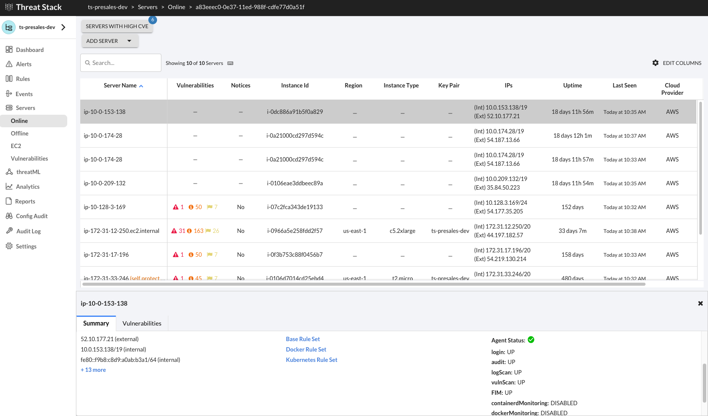

# threatstack-openshift


## Install Threat Stack Agent
### Deployment Options:
  - Daemonset: https://github.com/threatstack/threatstack-daemonset
  - Helm Chart: https://github.com/threatstack/threatstack-helm 

### Install using Helm

*Prerequisites*

- Helm installed
- Configured Values file

```

❯ git clone https://github.com/threatstack/threatstack-helm.git
❯ cd threatstack-helm
❯ helm repo add threatstack https://pkg.threatstack.com/helm
"threatstack" has been added to your repositories
❯ helm install threatstack-agent --values values.yaml threatstack/threatstack-agent
NAME: threatstack-agent
NAME: threatstack-agent
LAST DEPLOYED: Thu May 26 13:49:05 2022
NAMESPACE: default
STATUS: deployed
REVISION: 1
TEST SUITE: None
NOTES:
Threat Stack agents are being deployed. After a few minutes, you should see
agents showing up on your server tab.

    https://app.threatstack.com/


❯ oc get pods -o wide |grep threat
threatstack-agent-g4jcw                             1/1     Running   1              18d   10.0.209.132   ip-10-0-209-132.us-west-2.compute.internal   <none>           <none>
threatstack-agent-kubernetes-api-77d57bd6fc-p7qdm   1/1     Running   0              18d   10.0.174.28    ip-10-0-174-28.us-west-2.compute.internal    <none>           <none>
threatstack-agent-xc28r                             1/1     Running   0              18d   10.0.153.138   ip-10-0-153-138.us-west-2.compute.internal   <none>           <none>
threatstack-agent-zc6d8                             1/1     Running   0              18d   10.0.174.28    ip-10-0-174-28.us-west-2.compute.internal    <none>           <none>

❯ oc exec -it threatstack-agent-g4jcw -- tsagent status
  UP Threat Stack Agent Daemon
  UP Threat Stack Backend Connection
  UP Threat Stack Heartbeat Service
  UP Threat Stack Login Collector
  UP Threat Stack Log Scan Service
  UP Threat Stack Vulnerability Scanner
  UP Threat Stack Audit Collection


❯ helm delete threatstack-agent
release "threatstack-agent" uninstalled

```

## Post Install Configuration

1.	Update MachineConfig to disable Auditd on Worker Node
2.	Red Hat OpenShift will schedule all nodes to reboot to apply MachineConfig

Machine Config Operator manages MachineConfig objects. By using MCO, you can perform the following on an OpenShift Container Platform cluster: Configure nodes by using MachineConfig objects and Configure MCO-related custom resources.

Making a change to a worker or master:
Navigate to MachineConfig YAML file then oc create -f <MachineConfig>.yaml 

```
❯ oc apply -f 90-audit-disabled.yaml
```

The following is a required modification to allow Threat Stack to use the auditd connection. 
```
apiVersion: machineconfiguration.openshift.io/v1
kind: MachineConfig
metadata:
  annotations:
  labels:
    machineconfiguration.openshift.io/role: worker
  name: 90-audit-disabled
spec:
  config:
    ignition:
      version: 3.2.0
    systemd:
      units:
      - name: auditd.service
        enabled: false
```

## Threat Stack Cloud Security Platform® 


## Troubleshoot

```
  ❯ oc exec -it threatstack-agent-xpf6l -- bash
root@ip-10-0-141-120:/# service threatstack status
root@ip-10-0-141-120:/# ps aux | grep audi
root@ip-10-0-141-120:/# sysctl stop auditd
root@ip-10-0-141-120:/# apt-get install threatstack-agent-support

apt-get install --reinstall systemd